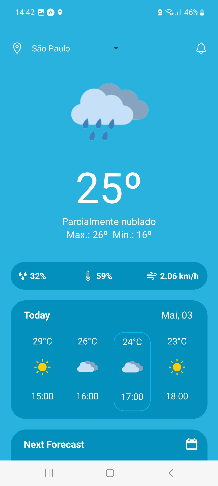
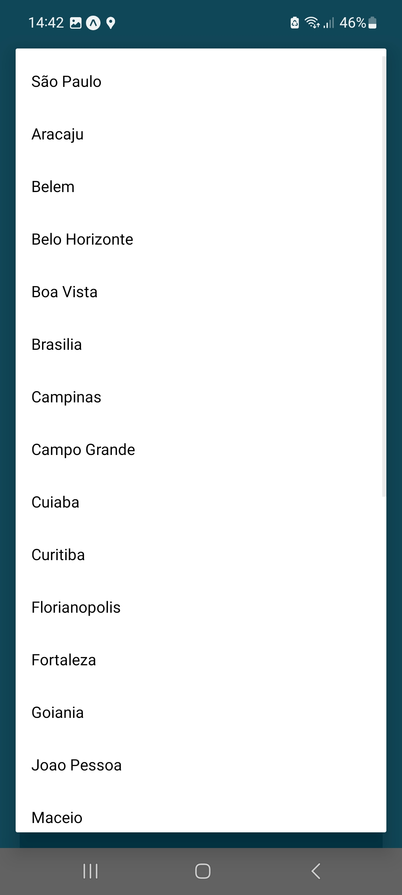
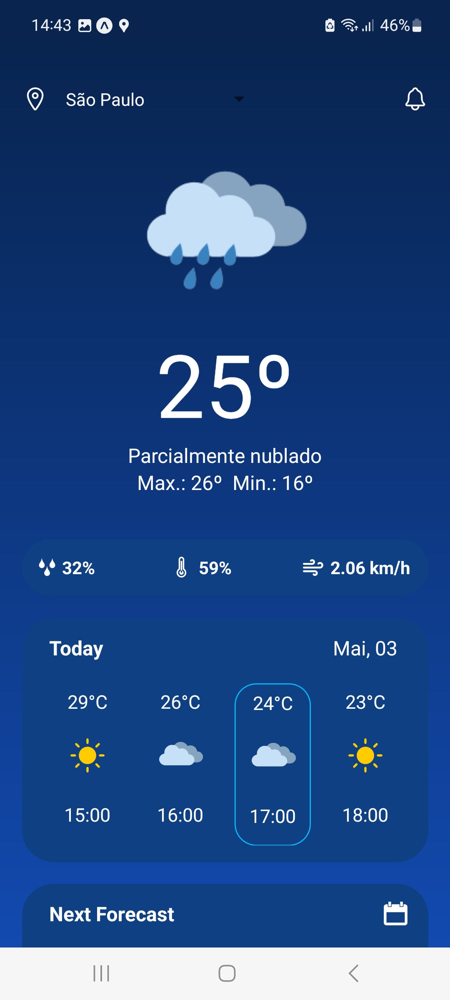

# NEES - Seleção Dev. Mobile
### Projeto para Previsão do Tempo - Roberto Alencar
##

Este projeto tem como objetivo o desenvolvimento de um App Mobile compatível com Android e IOS para exibir a previsão do tempo das capitais do Brasil. Os dados exibidos são da [HG BRASIL](https://hgbrasil.com) através da api [HG Weather](https://hgbrasil.com/status/weather).

## Tecnologias utilizadas:

- React Native / JavaScript
- CSS (Styled Components)

## Instruções para Instalação e Execução do Aplicativo:

### Clonar o repositório

```bash
$ git clone https://github.com/robertoalencar/mobile-weather-app.git
```

### Acessar a pasta do projeto via terminal

```bash
$ cd mobile-weather-app
```

### Instalar as dependências do projeto

```bash
$ yarn ou npm install
```

### Executar a aplicação

```bash
$ npx expo start
```

- Instale o EXPO em seu smartphone.
- Após realizar os itens acima, em seu terminal digite "A" para executar a aplicação em um emulador Android ou "I" para emulador IOS.

##
### Screenshot do App:
##

<p align="center">
    
    
    
    
    
    
</p>